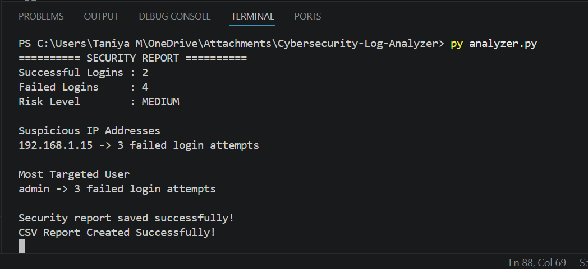
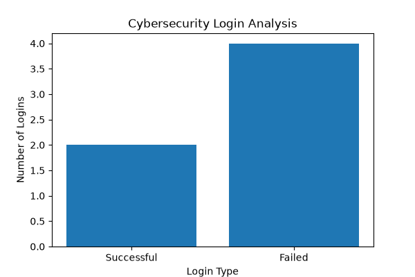

# 🔐 Cybersecurity Log Analyzer

## 📖 Overview

The Cybersecurity Log Analyzer is a Python-based security monitoring tool that analyzes login log files, detects suspicious activities, and generates security reports.

This project demonstrates Python programming, file handling, data analysis, and cybersecurity concepts.

---

## ✨ Features

- ✅ Analyze login log files
- ✅ Count successful logins
- ✅ Count failed logins
- ✅ Detect suspicious IP addresses
- ✅ Find the most targeted user
- ✅ Calculate risk level (LOW / MEDIUM / HIGH)
- ✅ Generate a TXT security report
- ✅ Generate a CSV security report
- ✅ Generate a login analysis bar chart
- ✅ Display report generation date and time
- ✅ Detect possible brute-force attacks

---

## 🛠 Technologies Used

- Python 3.14
- CSV Module
- Collections (defaultdict)
- Matplotlib
- Datetime

---

## 📂 Project Structure

```
Cybersecurity-Log-Analyzer/
│
├── analyzer.py
├── sample_log.txt
├── security_report.txt
├── security_report.csv
├── login_analysis.png
├── README.md
```

---

## ▶️ How to Run

1. Clone the repository

```
git clone https://github.com/yourusername/Cybersecurity-Log-Analyzer.git
```

2. Open the project folder

3. Install matplotlib

```
pip install matplotlib
```

4. Run the program

```
python analyzer.py
```

---

## 📊 Sample Output

```
========== SECURITY REPORT ==========

Successful Logins : 2
Failed Logins     : 4
Risk Level        : MEDIUM

Suspicious IP Addresses
192.168.1.15 -> 3 failed login attempts

Most Targeted User
admin -> 3 failed login attempts
```

---

## 🚀 Future Improvements

- Real-time log monitoring
- GUI using Tkinter
- Email alerts
- PDF report generation
- Dashboard using Flask
- AI-based anomaly detection

---

## 👩‍💻 Author

**Taniya M**

Computer Science Engineering Student

Interested in:
- Cybersecurity
- Artificial Intelligence
- Cloud Computing (AWS)
- Python Development

---
## 📸 Screenshots

### Terminal Output



### Login Analysis Chart


